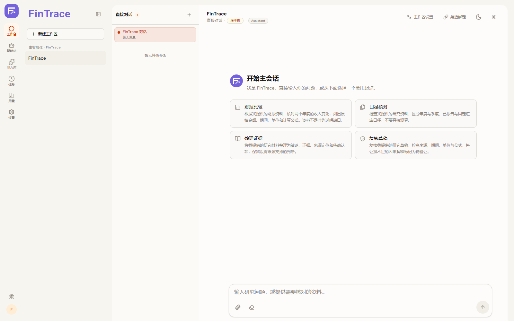
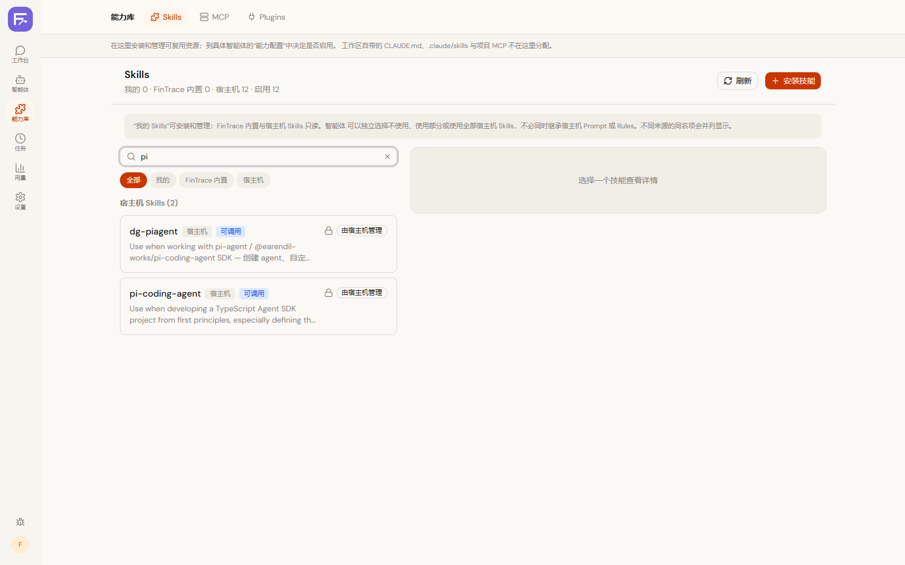
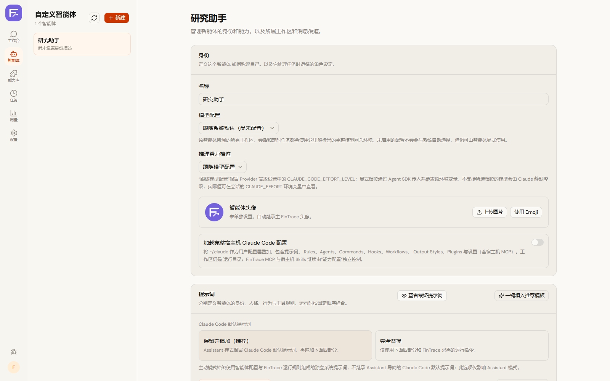
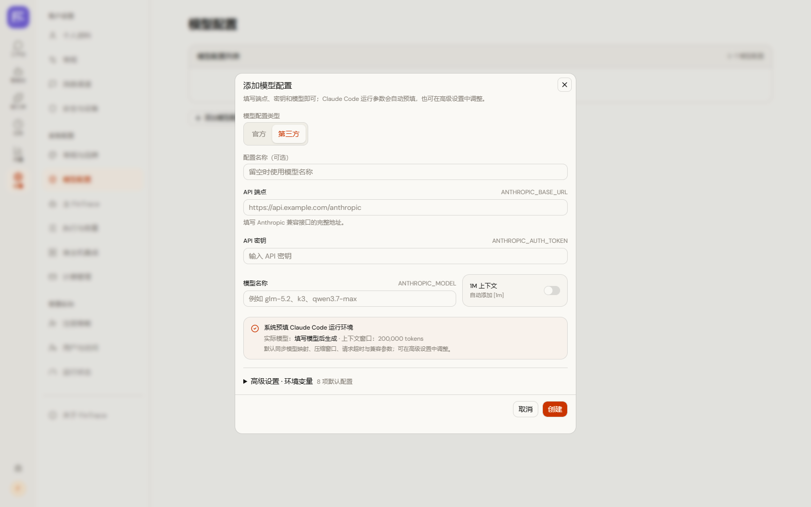
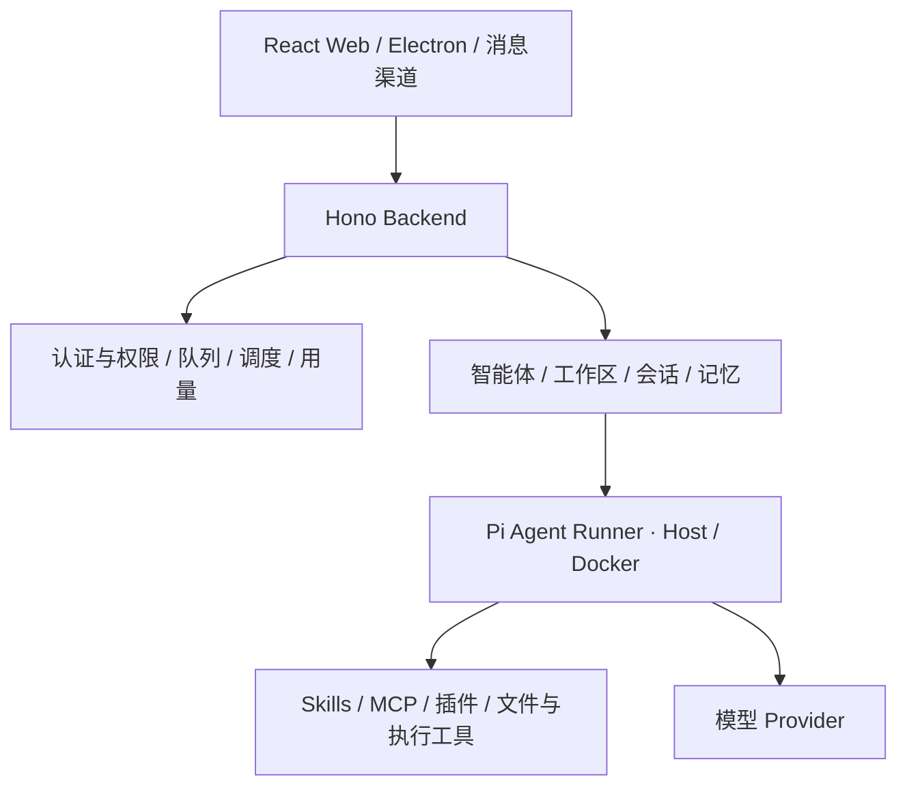

<p align="center">
  
</p>
<h1 align="center">FinTrace</h1>
<p align="center"><strong>基于 Pi Runtime 的金融研究 Agent 工作台</strong></p>
<p align="center">统一管理智能体、研究工作区、会话、记忆、工具与自动化任务。</p>
<p align="center">
  <a href="#快速开始">快速开始</a> ·
  <a href="#界面预览">界面预览</a> ·
  <a href="docs/RUNTIME.md">运行说明</a> ·
  <a href="docs/API.md">API 文档</a>
</p>



FinTrace 面向需要持续整理资料、调用工具和积累研究上下文的金融研究工作。它将 Pi Runtime 的 Agent 执行能力放入统一工作台，用工作区组织资料与记忆，用会话推进任务，通过 Skills、MCP 和插件扩展能力。

可以用于阅读财报、对比资料、核对指标口径、整理研究笔记，也可以承担一般的信息分析与自动化任务。具体数据源和研究方法由使用者的工具、提示词与工作区配置决定。

## 核心能力

| 能力 | 说明 |
| --- | --- |
| 智能体管理 | 配置角色、提示词、模型与可用能力，管理主智能体及自定义智能体 |
| 工作区与会话 | 分开组织研究上下文、文件和会话，支持流式回复、取消与会话恢复 |
| 记忆管理 | 查看和维护工作区记忆，保存可复用的资料与研究背景 |
| 能力库 | 管理 Skills、MCP 服务与插件，为智能体提供外部工具和专业流程 |
| 自动化任务 | 配置任务调度，在工作区内执行重复性工作 |
| 多入口与运行控制 | Web、Electron 与消息渠道入口；Host / Docker 执行模式；用户权限与用量统计 |

## 界面预览

以下截图来自本地运行的 FinTrace。截图展示产品界面，不包含固定公司的财报案例或预置研究结果。

### 能力库

集中管理工具与技能，按研究需要配置可用能力。



### 智能体管理

管理智能体身份、工作区与运行配置。



### 模型与服务配置

接入自己的模型 Provider，管理工作台的运行设置。



## 快速开始

建议 Node.js 24 与 npm。首次安装需下载依赖；`better-sqlite3` 与 `node-pty` 为原生模块，缺少预编译包时需要平台对应的 C/C++ 构建工具。

```bash
git clone https://github.com/yetuge/fintrace.git
cd fintrace
npm ci
npm --prefix web ci
npm --prefix container/agent-runner ci
npm run build:all
npm start
```

打开 `http://127.0.0.1:3000`，首次访问创建管理员，然后配置模型 Provider。首页直接进入工作台。模型密钥与运行数据保存于 Git 忽略的本地目录；仓库不附带模型凭证。

开发模式：

```bash
npm run dev:all
```

前端默认 `http://localhost:5173`，后端默认 `http://localhost:3000`。Host / Docker 配置见 [运行说明](docs/RUNTIME.md)。

## 架构



FinTrace 提供 Agent 工作台与执行底座。金融资料获取、口径检查和报告格式通过能力配置扩展；当前仓库没有内置证券行情服务或自动财报采集流水线。

## 开发与验证

```bash
# 前端契约与路由测试
npm run test:frontend
npm run build:web
npm run docs:check

# 完整运行底座（需安装根目录和 Runner 依赖）
npm test -- --run
npm run self-test
```

GitHub Actions 执行前端测试、文档检查与 Web 构建。当前验证范围见 [验证记录](docs/VERIFICATION.md)。

| 目录 | 职责 |
| --- | --- |
| `web/src/` | React 工作台、能力管理与配置界面 |
| `src/` | Hono API、认证、工作区、会话与调度 |
| `container/agent-runner/` | Pi Runtime 集成与 Agent 执行 |
| `shared/` | 前后端共享协议与类型 |
| `electron/` | 桌面入口与打包配置 |

## 技术栈

Pi Runtime · TypeScript · React · Vite · Hono · SQLite · Electron

[MIT License](LICENSE) · [API 文档](docs/API.md) · [权限矩阵](docs/ACL-MATRIX.md) · [安全策略](SECURITY.md)
