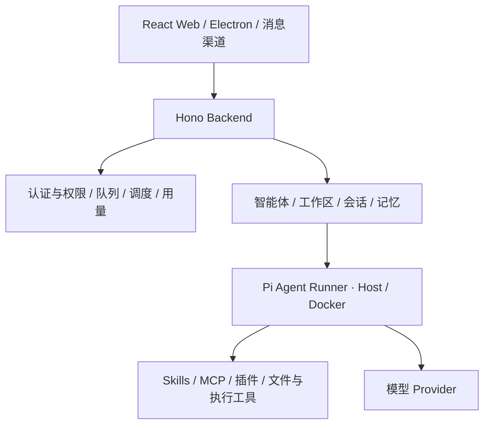

<p align="center">
  
</p>
<h1 align="center">FinTrace</h1>
<p align="center"><strong>基于 Pi Agent Runtime 的金融研究 Agent 工作台</strong></p>
<p align="center">统一管理智能体、研究工作区、会话、记忆、工具与自动化任务。</p>
<p align="center">
  <a href="#快速开始">快速开始</a> ·
  <a href="#界面预览">界面预览</a> ·
  <a href="docs/RUNTIME.md">运行说明</a> ·
  <a href="docs/API.md">API 文档</a>
</p>


FinTrace 面向需要持续整理资料、调用工具和积累研究上下文的金融研究工作。它将 Pi Agent Runtime 的 Agent 执行能力放入统一工作台，用工作区组织资料与记忆，用会话推进任务，通过 Skills、MCP 和插件扩展能力。

内置 SEC 官方年度财务研究工具，可以获取真实财务数据、计算指标并保存带官方引用的报告；也可以承担一般的信息分析与自动化任务。

最近三年研究可在同一工作台提问：“分析 Microsoft 最近三个完整财年的营收、净利润、经营现金流、现金及现金等价物、总负债趋势，列出可比同比，生成图表与逐条证据报告，保存到当前工作区。”英文公司名称、代码或 CIK 均可。原有单年度提问继续保留。

## 核心能力

| 能力             | 说明                                                                     |
| ---------------- | ------------------------------------------------------------------------ |
| 智能体管理       | 配置角色、提示词、模型与可用能力，管理主智能体及自定义智能体             |
| 工作区与会话     | 分开组织研究上下文、文件和会话，支持流式回复、取消与会话恢复             |
| 记忆管理         | 查看和维护工作区记忆，保存可复用的资料与研究背景                         |
| 能力库           | 管理 Skills、MCP 服务与插件，为智能体提供外部工具和专业流程              |
| 自动化任务       | 配置任务调度，在工作区内执行重复性工作                                   |
| 多入口与运行控制 | Web、Electron 与消息渠道入口；Host / Docker 执行模式；用户权限与用量统计 |
| SEC 财务研究     | 公司名称 / 股票代码 / CIK 识别，年度指标计算、官方引用与工作区文件保存   |

Web 会话统一使用行内“更多操作”菜单重命名和删除；旧默认对话也支持这些操作。
删除只清除所选会话的聊天记录与运行上下文，保留工作区文件、研究报告、记忆和其他会话。
有渠道关联的会话须先解绑；渠道原生话题仍由渠道管理。进入工作区恢复上次会话，删除当前
会话后切换到最近活跃的剩余会话；没有会话时展示空白页，发送第一条消息会创建独立会话。

## SEC 真实财务研究

先配置真实模型，再在当前工作区提问，例如：

> 分析 Microsoft 最近年度财务数据，列出营收、净利润、经营现金流、现金和总负债及可比同比，注明口径和 SEC 来源，把原始数据、指标与报告保存到当前工作区。

支持英文公司名称、股票代码（如 `MSFT`）及 CIK（如 `789019` 或 `CIK0000789019`）。名称匹配不唯一时会要求指定代码或 CIK，不猜测公司。

SEC 数据无需 API Key，但自动请求需要应用名称与真实联系邮箱。创建 Git 忽略的本地 `data/sec/sec.json`，内容为 `userAgent` 字段，值填写应用名称、空格和你同意公开给 SEC 的真实联系邮箱；不要提交此文件。也可设置 Runner 的 `SEC_USER_AGENT` 环境变量，Docker 工作区可使用现有环境变量设置。联系方式不会进入工具参数、报告或模型提示词。本地配置与模型配置独立，修改此文件后无需重启后端；若旧暖 Runner 尚未加载新增工具，请新建会话。

工具沿用 Pi 会话、当前工作区和文件面板：

- `fetch_sec_financials` 从 SEC 的股票代码表、Submissions 和 Company Facts 获取数据，由代码提取年度指标并计算同比。三年研究传 `years: 3`；省略或 `years: 1` 保持版本二单年度行为。
- `save_sec_report` 接收逐条结构化发现，校验当前研究的证据 ID，并与代码生成的指标表、口径、截至时间及官方链接一起保存。直接事实只取自代码事实目录；模型定性解释在只有指标依据时保守降为待验证判断，列出尚缺资料。
- 每次研究保存在 `financial-research/<CIK>-<唯一标识>/`，包含 `raw.json`、版本二 `metrics.json`、`manifest.json`、`findings.json` 与 `report.md`。在右侧上下文面板的文件页签中打开；新目录不会覆盖已有研究。旧版产物保留只读，不原地升级。

三年研究使用版本三，另外保存 `chart-data.json` 和 `trends.svg`；在现有文件面板打开 `report.md` 与 `trends.svg`。每个指标及币种单独绘制坐标轴，图表按代码转换为基础单位、百万或十亿并标明单位；缺失保留断点，负数正常显示。报告包含年度值、可比同比、图表引用、逐条证据、口径、截至时间与官方出处。

三年财年由年度申报与实际完整流量期间共同确认，不依赖 `fy`、`fp`、日历年份或 `frame`。目前保守支持 360–380 天的完整年度（包含五十二/五十三周）；短过渡期和冲突期间排除并说明。历史值统一采用截至研究日期最新年度披露的同期间值，包括修订及后续比较数，每个值保留标签、币种、单位、起止日期、filed 与 accession；不保证尚未披露的重述已覆盖。标签、币种变化保留实际值，但不计算跨口径同比或连续趋势。只有完整、连续且可比的链才生成连续变化事实；负数/零基数不计算常规增长率。最早展示年度无更早基数，取得不足三年时说明实际年份及缺口，不拼季度。

报告每条发现明确区分直接事实、原始分析解释与待验证判断，并链接到带数值、期间、标签、filed、accession 和官方出处的指标证据。引用有效、文件哈希一致和格式通过均不等于结论语义成立；本轮未读取申报正文，不宣称正文或因果已核验。工具结构、兼容策略和可复现命令见 [SEC 证据契约](docs/SEC-EVIDENCE.md)。

流量指标按实际年度起止日期选择，现金及总负债按同一财年期末选择。金额直接使用 SEC JSON 的基础货币单位，不推断千/百万倍数。修订与重复申报按截至日期和 accession 核验，采用最新披露的同期间数值；每个本期、上期值均保留标签、日期、单位和申报链接。同比只比较相同标签与币种的相邻年度；上期非正数、期间长度不可比时明确标注未计算。

当前范围：公司整体的标准 **US-GAAP** 标签、单年度或最近三个完整财年。现金为现金及现金等价物，总负债为全部会计负债；净利润归属口径按选用标签注明。自定义标签、IFRS、短过渡财年、冲突事实及无法可靠匹配的数据标为缺失，不由模型填数。不含行情、估值、季度分析、多数据源或投资建议。申报可能滞后；报告注明抓取时间、申报筛选截至日和财年期末。

SEC 请求在共享目录中串行限流（最多每秒两次，Docker Runner 共用同一挂载），单次请求超时二十秒，网络与短暂服务错误最多尝试三次。长 Retry-After、拒绝访问、限流、缺失或无效响应明确报错，不切换模拟数据。Docker 需共享本地 `data/sec/` 挂载；多台独立部署共用出口 IP 时仍需统一外部限流。

官方说明：[公开数据 API](https://www.sec.gov/search-filings/edgar-application-programming-interfaces) · [访问策略与 User-Agent](https://www.sec.gov/search-filings/edgar-search-assistance/accessing-edgar-data)。

确定性测试：`npm run test:financial`。离线核验：`npx tsx scripts/verify-sec-artifacts.ts <research-directory>`（只读支持版本一、二、三）。显式真实 SEC 验证：`npx tsx scripts/verify-sec-live.ts`，三年模式增加 `--years=3`（默认写入 Git 忽略的 `data/sec-verification/`，不调用模型；三年模式还保存代码事实报告并离线核验图表）。真实模型研究通过正常登录后的工作台执行，会消耗所配置模型的用量。

以下为实际运行中从文件面板打开的报告与原始数据目录，完整验证与限制见 [验证记录](docs/VERIFICATION.md)，任务、结果与证据说明见 [Microsoft 真实运行案例](docs/cases/microsoft-sec-real-run.md)。


## 界面预览

以下截图来自本地运行的 FinTrace。截图展示产品界面，不包含固定公司的财报案例或预置研究结果。

### 能力库

集中管理工具与技能，按研究需要配置可用能力。


### 智能体管理

管理智能体身份、工作区与运行配置。


### 模型与服务配置

接入自己的模型 Provider，管理工作台的运行设置。


## 快速开始

建议 Node.js 24 与 npm。首次安装需下载依赖；`better-sqlite3` 与 `node-pty` 为原生模块，缺少预编译包时需要平台对应的 C/C++ 构建工具。

```bash
git clone https://github.com/yetuge/fintrace.git
cd fintrace
npm ci
npm --prefix web ci
npm --prefix container/agent-runner ci
npm run build:all
npm start
```

打开 `http://127.0.0.1:3000`，首次访问创建管理员，然后配置模型 Provider。首页直接进入工作台。模型密钥与运行数据保存于 Git 忽略的本地目录；仓库不附带模型凭证。

Windows 本地使用可在依赖安装后双击根目录的 `Start-FinTrace.vbs`，自动启动后端与桌面端。详情见 [运行说明](docs/RUNTIME.md)。

开发模式：

```bash
npm run dev:all
```

前端默认 `http://localhost:5173`，后端默认 `http://localhost:3000`。Host / Docker 配置见 [运行说明](docs/RUNTIME.md)。

## 架构



FinTrace 通过现有 Pi 工具机制提供 SEC 年度财务采集、指标计算和引用报告保存；工作台、会话与文件面板保持统一。其他研究能力可通过 Skills、MCP 和插件扩展。

## 开发与验证

最小 Agent Benchmark 包含六项任务，评价真实 Agent 工具行为、证据与文件交付，异常任务按合理失败处理评分；不把单元测试数量当作成绩。离线复核 `npm run benchmark -- score --batch=<batch>`；显式真实执行 `npm run benchmark -- run --live --batch=<new-batch>`，默认整轮最多 24 次请求、18,000 输出 token。支持 `--task=<id>` 定向执行/复核与 `summarize` 汇总；任务、评分边界与复现说明见 [Agent Benchmark](docs/AGENT-BENCHMARK.md)。CI 仅运行 `npm run test:benchmark` 离线测试。

```bash
# 前端契约与路由测试
npm run test:frontend
npm run build:web
npm run docs:check

# 完整运行底座（需安装根目录和 Runner 依赖）
npm test -- --run
npm run self-test
```

GitHub Actions 保留前端测试、文档检查与 Web 构建，并增加 SEC 确定性测试、必要工具集成测试、Agent Runner 与后端构建。日常 CI 不访问真实模型或 SEC，无需密钥、本地 SEC 配置或运行数据。当前验证范围见 [验证记录](docs/VERIFICATION.md)。

| 目录                      | 职责                               |
| ------------------------- | ---------------------------------- |
| `web/src/`                | React 工作台、能力管理与配置界面   |
| `src/`                    | Hono API、认证、工作区、会话与调度 |
| `container/agent-runner/` | Pi Agent Runtime 集成与 Agent 执行 |
| `shared/`                 | 前后端共享协议与类型               |
| `electron/`               | 桌面入口与打包配置                 |

## 技术栈

Pi Agent Runtime · TypeScript · React · Vite · Hono · SQLite · Electron

[MIT License](LICENSE) · [API 文档](docs/API.md) · [权限矩阵](docs/ACL-MATRIX.md) · [安全策略](SECURITY.md)
