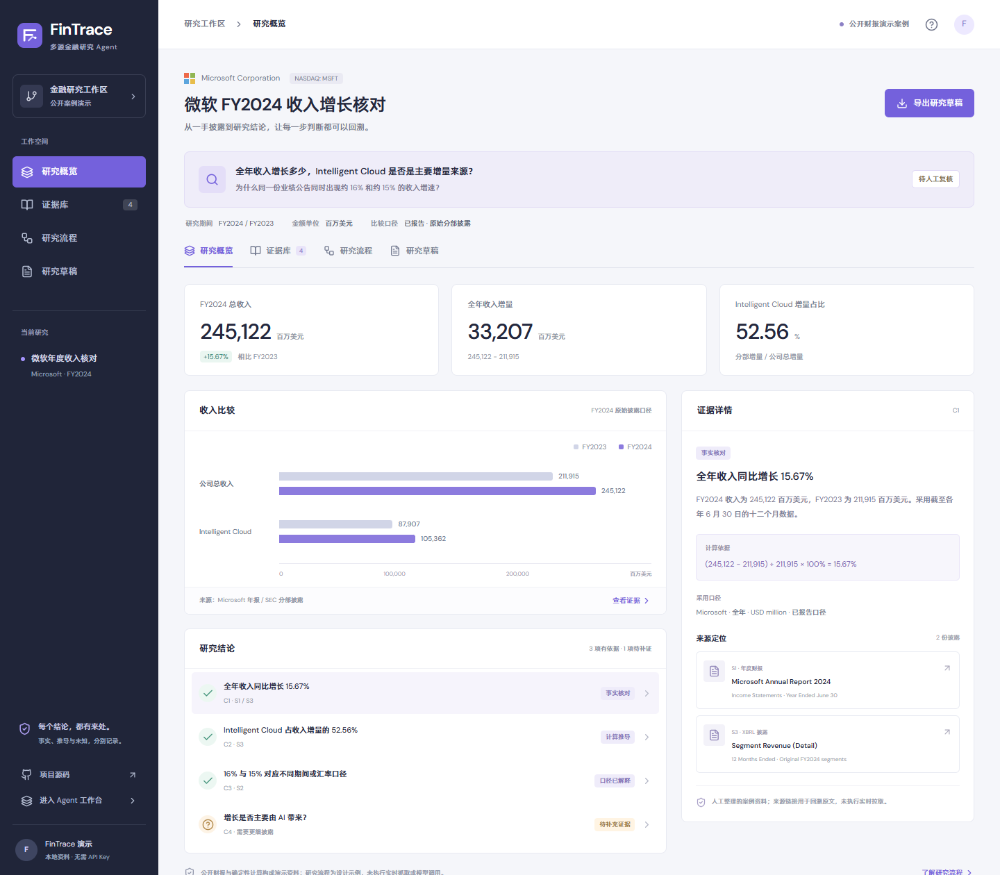
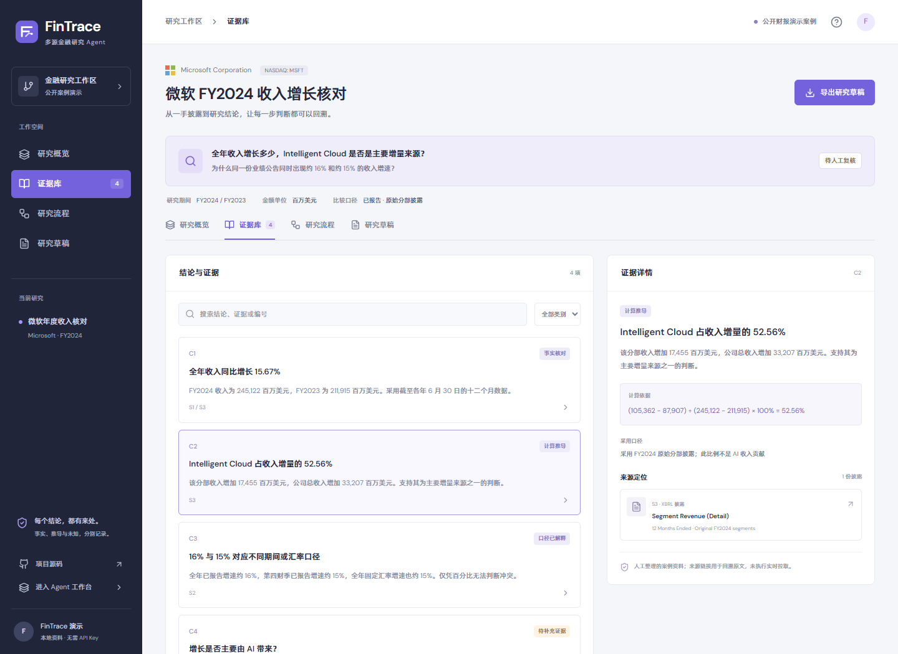
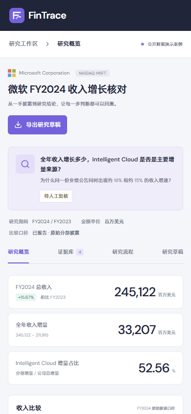
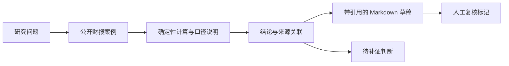

<p align="center">
  
</p>
<h1 align="center">FinTrace</h1>
<p align="center"><strong>多源金融研究 Agent · 让每个研究结论都有来处</strong></p>
<p align="center">从研究问题、一手披露与口径核对，到带证据的研究草稿。</p>
<p align="center">
  <a href="https://yetuge.github.io/fintrace/">在线体验</a> ·
  <a href="#快速体验">本地启动</a> ·
  <a href="docs/RESEARCH-CASE.md">研究案例</a> ·
  <a href="docs/RUNTIME.md">Agent 工作台</a>
</p>



FinTrace 将通用 Agent 工作台场景化为金融研究工作区：以微软 FY2024 收入核对为例，集中查看原始数据、计算依据、来源定位、口径差异与待确认判断。首页无需登录、模型密钥或后端服务，适合项目展示与研究流程讲解。

> 当前版本是可交互的金融研究展示层，使用人工整理的公开财报案例与确定性计算。金融数据 Adapter、自动补证与真实 Agent 执行轨迹尚未接入；已有运行底座与场景设计的边界见下文。

## 快速体验

建议使用 Node.js 24 与 npm，仅启动展示首页：

```bash
git clone https://github.com/yetuge/fintrace.git
cd fintrace
npm --prefix web ci
npm run dev:web
```

打开 `http://localhost:5173`。无需安装根目录的后端依赖。

构建静态展示版：

```bash
npm run build:showcase
npm --prefix web run preview
```

此构建只包含公开研究页面，适合静态托管；`npm run build:web` 则构建完整 Agent 客户端。两者均输出到 `web/dist/`。

## 可以体验什么

| 视图     | 展示与交互                                         |
| -------- | -------------------------------------------------- |
| 研究概览 | 年度收入比较、增量与分部占比；点击结论查看对应证据 |
| 证据库   | 按关键词与类别筛选；查看公式、口径与原文定位       |
| 研究流程 | 逐步展开研究范围、来源收集、口径解释与补证设计     |
| 研究草稿 | 带引用的事实与推导；人工复核标记；下载 Markdown    |

复核标记只保存在本次页面状态，刷新后重置；即使标记复核，证据不足的 AI 因果解释也保留为待确认项。页面使用本地字体并适配手机。

<p>
  
  
</p>

## 一个具体的研究任务

“微软 FY2024 全年收入增长多少？Intelligent Cloud 是否是主要增量来源？为什么公告同时出现约 16% 与约 15% 的收入增速？”

案例以年度财报、官方业绩公告和 SEC XBRL 分部表为来源，核对期间、金额单位、汇率基础与原始分部口径，输出四条可追溯判断。分部增量占比不会被解释为 AI 收入贡献。

三份资料均来自同一公司的披露，交叉核对用于检查转录、期间与口径，不代表三个独立研究观点。原始金额、复算公式、来源链接与实现边界见 [案例说明](docs/RESEARCH-CASE.md)。

## 架构与实现边界



展示层运行于浏览器；“研究流程”页描述未来 Agent 的业务步骤。真实运行底座是另一条执行路径：

```text
React Web / Electron / 消息渠道
                ↓ HTTP + WebSocket
Hono Backend · Auth · Queue · Scheduler · ACL
                ↓
Workspace · Session · Memory · Skills / MCP
                ↓
Pi Agent Runner · Host / Docker
```

| 范围                                                 | 当前状态                             |
| ---------------------------------------------------- | ------------------------------------ |
| 金融研究首页、证据浏览、筛选与导出                   | 本次实现，可离线使用内置资料进行展示 |
| 案例数值复算与引用关联                               | 本次实现，包含针对性测试             |
| Agent / Workspace / Session、流式输出、取消与恢复    | 基于 MiniClaw 的已有运行底座         |
| Workspace Memory、Skills、MCP、任务调度、执行边界    | 保留上游实现，未声称本次重新开发     |
| 财报与公告自动拉取、来源失败与替代来源处理           | 待接入                               |
| 证据 Schema 到 Memory 的映射、自动口径校验与补证预算 | 设计阶段                             |
| 真实金融任务的工具 Trace 与端到端验收                | 待验证                               |

## 运行 Agent 工作台

真实会话需要后端及模型配置，按 [运行说明](docs/RUNTIME.md) 安装和启动。Web 首页仍进入案例展示，通过 `/chat` 访问工作台。模型调用可能产生所选 Provider 的费用。

保留上游的 `MINICLAW_*` 环境变量、API 与内部数据命名，避免破坏兼容性。当前品牌改造集中在 Web；Electron 打包资源沿用上游。

## 开发与验证

具体检查结果与未覆盖范围见 [展示层验证记录](docs/VERIFICATION.md)。

```bash
# 安装展示层依赖后，从仓库根目录执行
npm run test:showcase
npm run build:showcase

# 完整 Web 客户端的 TypeScript 检查与构建
npm run build:web
```

GitHub Actions 验证展示层计算、引用与路由策略，构建后发布静态演示到 GitHub Pages。完整运行底座的测试入口保留为 `npm test -- --run` 与 `npm run self-test`，需要安装后端和 Runner 依赖；不将展示层测试结果等同于金融 Agent 闭环已验证。

代码入口：

| 文件                                | 职责                           |
| ----------------------------------- | ------------------------------ |
| `web/src/pages/ResearchPage.tsx`    | 研究工作台与展示交互           |
| `web/src/features/research/case.ts` | 案例来源、结论、计算与报告导出 |
| `web/src/styles/research.css`       | FinTrace 展示视觉与响应式布局  |
| `web/src/App.tsx`                   | 展示与真实工作台路由           |
| `src/` / `container/agent-runner/`  | 保留的后端与 Pi 运行底座       |

## 来源与许可

本项目基于 [MiniClaw](https://github.com/helsome/miniclaw) 进行场景化改造，保留原作者与贡献者的 MIT 版权声明。FinTrace 新增金融研究展示界面、公开案例模型、确定性复算、证据与草稿交互，以及展示部署配置；上游功能说明归档在 [MINICLAW-UPSTREAM.md](docs/MINICLAW-UPSTREAM.md)。

[MIT License](LICENSE) · [API 文档](docs/API.md) · [权限矩阵](docs/ACL-MATRIX.md) · [安全策略](SECURITY.md)
