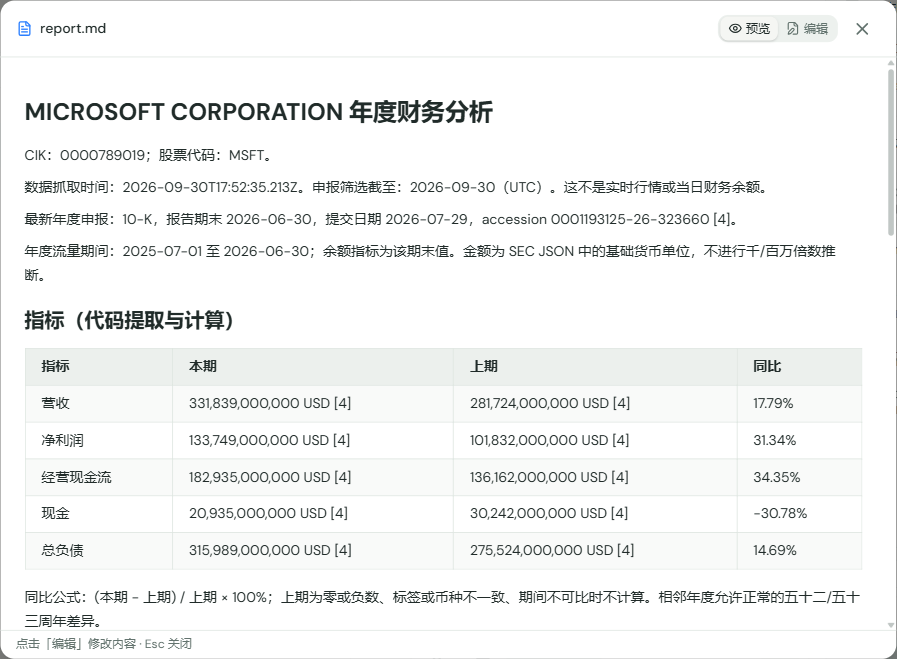
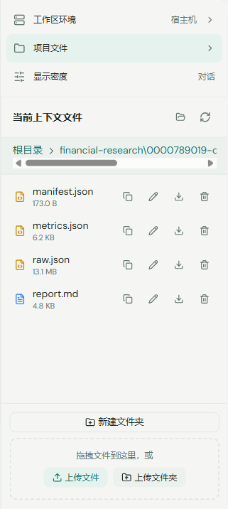

# FinTrace 实测案例：基于 SEC 官方数据的 Microsoft 年度财务研究

本案例记录 FinTrace 在正常登录的 Electron 工作台中完成的一次真实运行：使用者提交研究问题，Pi Agent 调用 SEC 数据工具，代码提取和计算财务指标，Agent 生成定性分析，工具将带官方引用的报告及数据保存到当前工作区，并从文件面板打开报告。

案例定位为**真实数据与真实模型驱动的技术验证案例**，可用于项目展示、作品集与技术面试。当前证据支持数据获取、指标计算、工具协作与文件交付闭环；实际客户使用、人工研究效率提升和投资决策效果尚无证据。

记录日期：2026-10-01，Asia/Shanghai。数据采用该次运行保存的快照，后续 SEC 数据更新可能使重新运行的结果发生变化。

## 研究任务与输入

研究任务是在现有工作台中输入公司名称，获取最近年度公开财务数据，比较五项基础指标，并交付可以追溯来源的研究文件。手工执行这一任务通常需要识别公司、寻找年度申报、核对财务期间和货币单位、计算同比，再整理报告与原始资料。本次实测检查这些步骤是否能够在同一个 Agent 工作区内完成。

本次实际提交的研究问题为：

> 请分析 Microsoft 最新年度的真实公开财务数据，包括营收、净利润、经营现金流、现金及总负债，在可比时给出同比。使用 SEC 官方来源，注明期间、单位、数据截至时间和申报链接，不要补造缺失值。把原始 JSON、结构化指标和带引用的 Markdown 报告保存到当前工作区。报告保留简短的主要发现，聊天回复不超过三百字，并告诉我报告路径。

运行环境为现有 Electron 工作台与 Host 执行模式，使用已配置的真实模型和已有登录状态。研究会话具有独立上下文，并与当前工作区共享文件目录。

## 实际执行过程

| 步骤       | 执行主体               | 本次实际行为与输出                                                                                    |
| ---------- | ---------------------- | ----------------------------------------------------------------------------------------------------- |
| 接收任务   | 工作台与 Pi Agent      | 接收上述自然语言问题，进入既有会话执行链路                                                            |
| 获取数据   | `fetch_sec_financials` | 通过 SEC 股票代码表将 Microsoft 解析为 MSFT、CIK `0000789019`，获取 Submissions 与 Company Facts JSON |
| 提取与计算 | TypeScript 代码        | 按最新年度申报、实际期间、币种与 accession 选择事实，提取五项指标并计算可比同比                       |
| 保存数据   | 数据工具               | 保存原始响应、结构化指标与 SHA-256 完整性摘要                                                         |
| 组织分析   | 真实模型               | 根据工具返回的指标生成简短定性发现，并调用报告保存工具                                                |
| 生成报告   | `save_sec_report`      | 由代码写入数值表、口径、截至时间、公式与 SEC 官方链接，合并 Agent 的定性发现                          |
| 交付与检查 | 工作台、模型与核验脚本 | 返回产物路径；模型额外执行一次只读 Bash 文件核对；从文件面板成功预览报告，并离线重新计算核验          |

原始财务 JSON 保留在文件中，模型接收提取后的指标与来源。数值选择和同比计算由代码承担；模型负责工具调用、表达和定性解释。报告保存工具限制定性发现中的数字输入，数值表由代码生成。

本次提交一次用户研究问题，工具循环触发四次模型请求，总输出 token 为 `1174`。这组记录反映本次运行规模，不代表固定成本、平均时延或稳定性能指标。

## 财务结果与口径

本次选择 Microsoft 年度申报 Form 10-K，报告期末为 **2026-06-30**，提交日期为 **2026-07-29**，accession 为 `0001193125-26-323660`。

本期流量期间为 `2025-07-01` 至 `2026-06-30`，上期为 `2024-07-01` 至 `2025-06-30`；现金与总负债分别使用两个财年期末余额。两期数值均可追溯到本次选用年度申报中披露的本期或比较数据。

| 指标             |        本期 USD |        上期 USD |    同比 |
| ---------------- | --------------: | --------------: | ------: |
| 营收             | 331,839,000,000 | 281,724,000,000 |  17.79% |
| 净利润           | 133,749,000,000 | 101,832,000,000 |  31.34% |
| 经营现金流       | 182,935,000,000 | 136,162,000,000 |  34.35% |
| 现金及现金等价物 |  20,935,000,000 |  30,242,000,000 | -30.78% |
| 总负债           | 315,989,000,000 | 275,524,000,000 |  14.69% |

金额为 SEC JSON 的基础货币单位；同比公式为 `(本期 − 上期) / 上期 × 100%`，报告展示结果保留两位小数。现金口径不包含短期投资与受限现金；总负债包含流动和非流动会计负债。净利润选用 `us-gaap:NetIncomeLoss`，报告及结构化指标保留该标签以便核查归属口径。

数据抓取时间为 `2026-09-30T17:52:35.213Z`，对应北京时间 **2026-10-01 01:52:35**。申报筛选截至日为 `2026-09-30`（UTC）；年度数据的实际期末仍是 `2026-06-30`。

从已核验的数值可以直接观察到：营收、净利润和经营现金流均同比增长，经营现金流的增速高于营收；期末现金及现金等价物下降，总负债增长。以上方向和增速比较可以由指标表复算。

原始 Agent 报告还包含“盈利质量改善”“主营业务盈利能力增强”“杠杆压力相对可控”等解读。这些判断涉及现金流构成、非经营损益、资本开支、负债结构或其他信息，**尚未逐项结合申报正文核验**。案例展示时应将它们列为待验证判断；当前五项指标不足以证明这些解释。

官方核查入口：[Microsoft 年度申报](https://www.sec.gov/Archives/edgar/data/789019/000119312526323660/msft-20260630.htm)、[Submissions JSON](https://data.sec.gov/submissions/CIK0000789019.json)、[Company Facts JSON](https://data.sec.gov/api/xbrl/companyfacts/CIK0000789019.json)、[股票代码与 CIK 映射](https://www.sec.gov/files/company_tickers.json)。线上接口可能继续更新，复核本次结果应先使用保存的原始快照。

## 交付文件与证据

本次工作区产物目录为：

```text
data/groups/main/financial-research/
└── 0000789019-d51e63b6-a9b3-48d5-945c-e1f937f3eaf8/
    ├── raw.json          原始 SEC JSON、请求 URL 与获取时间
    ├── metrics.json      指标、期间、单位、标签、同比与申报来源
    ├── manifest.json     原始数据及指标文件的 SHA-256 摘要
    ├── report.md         Agent 分析与代码生成的数值、口径和引用
    └── verification.json 离线复算、完整性与工具执行核验摘要
```

| 证据                                                                                                                    | 可核验内容                                                   |
| ----------------------------------------------------------------------------------------------------------------------- | ------------------------------------------------------------ |
| [研究报告](../../data/groups/main/financial-research/0000789019-d51e63b6-a9b3-48d5-945c-e1f937f3eaf8/report.md)         | 指标表、期间、口径、定性分析及官方链接                       |
| [结构化指标](../../data/groups/main/financial-research/0000789019-d51e63b6-a9b3-48d5-945c-e1f937f3eaf8/metrics.json)    | 每个值的标签、单位、期间、filed、accession 与源文件链接      |
| [原始响应](../../data/groups/main/financial-research/0000789019-d51e63b6-a9b3-48d5-945c-e1f937f3eaf8/raw.json)          | 实际获取的 SEC 数据快照，约 13.1 MB                          |
| [核验摘要](../../data/groups/main/financial-research/0000789019-d51e63b6-a9b3-48d5-945c-e1f937f3eaf8/verification.json) | 完整性校验、重新计算结果、成功金融工具调用及本次模型输出规模 |
| [项目验证记录](../VERIFICATION.md)                                                                                      | 两家公司获取结果、构建测试、基线失败复现及未验证范围         |

工作区数据属于 Git 忽略的本地运行产物。上述数据文件链接可在本地使用；只分享仓库时，需要另外提供经检查的案例文件，接收者才能打开这些链接。运行目录内的认证、模型配置、会话和联系信息应保持私有。

以下截图直接来自实际运行中的文件面板与报告预览：





## 验证结果与复核方法

本次 Pi 会话记录中，`fetch_sec_financials` 与 `save_sec_report` 的工具结果均为 `isError: false`。会话 ID 为 `866c8c2e-b1e0-4cb4-a6b5-547197377f52`。

离线核验重新读取原始 SEC 响应并执行指标提取与同比计算，结果与保存的结构化指标一致。原始数据及指标文件的 SHA-256 摘要匹配，报告的本期数值、同比展示和申报来源链接检查通过。该核验验证数据与产物的一致性，不替代完整财报审阅。

工程验证包括：

- Apple 与 Microsoft 两家真实公司的五项指标获取成功，Microsoft 完成真实模型端到端流程。
- SEC 确定性测试及工具初始化、插件挂载、Provider Runtime 相关测试，共四个文件、**47 项通过**。
- 后端、Web、Agent Runner 构建通过，桌面端主进程与 preload 构建并实际启动；文档、格式和同步检查通过。
- 全仓库测试出现 30 个失败文件、45 项失败；在改动前提交 `927018e` 的独立工作树中，全部失败文件复现，失败测试数量仍为 45。全仓库测试尚未全部通过。

在 FinTrace 仓库根目录，可以只核验现有产物，不联网、不调用模型：

```powershell
npx tsx scripts/verify-sec-artifacts.ts data/groups/main/financial-research/0000789019-d51e63b6-a9b3-48d5-945c-e1f937f3eaf8
```

该命令会更新产物目录中的 `verification.json`。如需连同模型工具调用核验，使用带会话目录的命令：

```powershell
npx tsx scripts/verify-sec-artifacts.ts data/groups/main/financial-research/0000789019-d51e63b6-a9b3-48d5-945c-e1f937f3eaf8 data/sessions/main/agents/866c8c2e-b1e0-4cb4-a6b5-547197377f52/.claude/sessions
```

若要发起新的研究，可在正常登录的工作台新建会话，输入本案例问题或其他美股公司代码。新的研究会保存到新的唯一目录，并消耗已配置模型的用量；SEC 获取还需要本地真实联系信息配置。配置方法见 [README](../../README.md)。

## 可用于展示的结论与当前边界

可用于项目介绍的表述：

> 在 FinTrace 现有 Pi Agent 工作台中实现 SEC 官方年度财务研究闭环，支持公司名称、股票代码和 CIK 输入，由代码处理期间、单位、修订数据和可比同比，将原始 JSON、结构化指标与带引用报告保存到工作区。以 Apple、Microsoft 验证真实数据获取，并通过一次正常登录桌面端的 Microsoft 研究完成真实模型端到端验证，相关测试 47 项通过。

这段表述描述已实现能力和已完成验证。案例暂未提供客户部署、持续使用、并发负载、人工研究耗时对照、节省成本或投资收益等效果证据，因此这些内容不应加入展示结论。

当前接入范围是 SEC 公司整体标准 US-GAAP 标签与最近年度申报。IFRS、自定义标签、季度分析和短过渡财年暂未支持，无法可靠取得的数据明确标为缺失。Docker 真实运行、打包安装版与跨多台部署的共享出口限流尚未实测。

若后续需要升级为专业投研案例，应继续核查申报正文及定性推断；若需要升级为真实业务落地案例，应记录实际使用者、任务场景、反馈和可量化效果。
